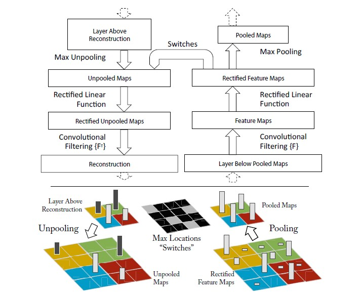

# Visualizing and Understanding Convolutional Networks

Matthew D. Zeiler and Rob Fergus, **ECCV, 2014**

## Summary
Convolutional networks have been instrumental in providing state-of-the-art performance in various Computer Vision tasks. However, they have been considered as black boxes in terms of interpretability of the higher layers involved in the network. This paper presents a novel visualization technique which reveals the input stimuli that excite individual feature maps at any layer of the network. A Deconvolutional Network (whose structure is defined ahead) is used for this purpose, which projects the feature activations back to the input pixel space. The paper also performs an ablation study which allows us to observe which network layers contribute to performance.

<!---     
    Feature map: the matrix generated after convolution with the filter (aka activation maps)
    Ablation study: a procedure in which certain parts of the network are removed to get a better understanding of the network's behaviour
-->

### Deconvolutional Networks

A Deconvolutional Network (deconvnet) is used to map feature activations back to the input pixel space, to show which input pattern led to a given feature excitation in any layer. A deconvnet layer is attached to each convnet layer, and to study a given convnet activation, we set all other activations inthe layer to zero and pass the feature maps as input to the attached deconvnet layer, as shown in the image below.  

    

 

- **Unpooling**: The max-pooling operation applied in a convnet is non-invertible. However, we can approximate its inverse by storing the locations of the max elements (from the max-pooling regions) in switch variables, and in the deconvnet layer, place the reconstructions in corresponding locations stored in the switch variables.
- **Rectification**: The reconstructed signal is passed through RELU non-linearities.
- **Filtering**: To invert the convolution operation of the convnet, we apply the transposed version of the same filter to our rectified feature maps.

<!--- Generative vs Discriminative models -->

## Key Takeaways

- We observe that the network shows several intuitively desirable properties such as compositionality, increasing invariance and class discrimination.
- We note that this visualization can be extremely helpful in improving our model, by correctly identifying the problems associated with it.
- We observe that the model is sensitive to the local structure of the image and not just the broader context.
- Through an ablation study, we note that having a minimum depth is much more likely to influence performance than any other individual section.

## References
- [Visualizing and Understanding Convolutional Networks](https://cs.nyu.edu/~fergus/papers/zeilerECCV2014.pdf)
- [Paper Club: Visualizing and Understanding Convolutional Networks](https://medium.com/@jamesvanneman/paper-club-visualizing-and-understanding-convolutional-networks-629fef9ceb8b)